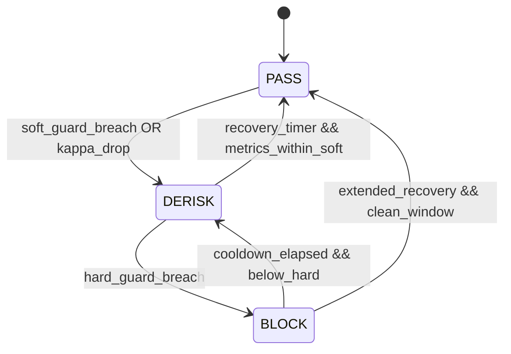

# AURORA v1.2 (Production-Ready Skeleton)

This repository implements the AURORA concept (teacher–student, certification, regime-aware) with a working API and training/inference pipelines.

## Quick start

- Build and run API with Prometheus and Grafana:

```bash
# Build API image and start stack
docker compose up --build -d

# API: http://localhost:8000/docs
# Prometheus: http://localhost:9090
# Grafana: http://localhost:3000 (create a dashboard and add Prometheus datasource)
```

- Run tests locally:
```bash
pip install -r requirements.txt
pip install -r requirements-dev.txt
pytest -q
```

## Calibration & Alerting (NEW)

The replay driver (`run_r0.py`) now supports an offline calibration mode that grid-searches governance / acceptance / ICP parameters and scores each configuration with a composite objective while enforcing hard constraints. Alerting integrates via Prometheus rule files mounted into the stack.

### Run Calibration

Minimal example (using defaults from profile config `configs/production.yaml` under `calibration.*`):

```bash
python run_r0.py \
	--profile default \
	--calibrate \
	--grid "governance.acceptance.hysteresis.dwell_pass=[5,10];governance.acceptance.hysteresis.dwell_derisk=[15,30]" \
	--calib-out-dir calib_runs/example \
	--top-k 5
```

If `--objective-weights` or `--hard-constraints` are omitted, profile defaults are used. Provide overrides explicitly to experiment.

Extended example with explicit overrides and extra hysteresis param:
```bash
python -m living_latent.scripts.run_r0 \
	--logs_dir shadow_logs --profile default --seed 1337 \
	--calibrate \
	--grid 'kappa.tau_pass=0.72,0.75;kappa.tau_derisk=0.48,0.50;acceptance.hysteresis.tau_pass_up=0.78,0.80' \
	--objective-weights 'w_pass=1,w_derisk=0.5,w_block=2,w_viol=3,w_lat=1,w_sur=1,w_flap=0.5' \
	--calib-out-dir calib --top-k 5
```

### Grid Syntax
Semicolon-separated assignments; each assignment is `path.to.param=[comma,separated,values]`.

Supported value forms:
- Scalar numbers (int/float)
- Strings (no spaces)
- Booleans `true|false`
- Lists inside brackets parsed into Python lists (e.g. `acceptance.guards.latency_p95.soft=[250,300,350]`).

You can also store a grid spec in a text file (one assignment per line) and provide `--grid @path/to/grid.txt`.

File-based formats supported (detected by extension):
- `.txt` – same syntax as inline (one assignment per line)
- `.yaml` / `.yml` or `.json` – mapping of param path to list of values, e.g.:
	```yaml
	kappa.tau_pass: [0.72, 0.75]
	kappa.tau_derisk: [0.48, 0.50]
	acceptance.hysteresis.tau_pass_up: [0.78, 0.80]
	```
This is parsed into the cartesian product identical to inline usage.

### Scoring (ScoreV1)
We maximize `ScoreV1`.

Core components (metrics are derived from replay):
- pass_share / derisk_share / block_share – proportions of decisions in each FSM state.
- coverage_empirical – interval coverage vs lower bound target.
- surprisal_p95 – tail calibration risk proxy.
- latency_p95_ms – decision latency SLO proxy.
- violation_events – counts of guard violations (used indirectly via shares/penalties).
- flap_rate_k – transitions per 1000 steps (stability indicator).

Typical weighted objective (example semantics):
```
score = (
	+ w_pass   * pass_share
	- w_derisk * derisk_share
	- w_block  * block_share
	- w_viol   * violation_rate
	- w_lat    * latency_p95_ms / SLO
	- w_sur    * surprisal_p95 / guard
	- w_flap   * (flap_rate_k / 10)
	+ coverage_term
)
```
`coverage_term` usually = max(0, (coverage_empirical - coverage_lower_bound)) scaled, or its deficit multiplied by a penalty weight; implementation may normalize internally.

`flap_rate_k` (FSM transitions per 1000 observations) is divided by 10 before weighting to keep it numerically comparable; penalizing flapping encourages hysteresis settings that stabilize state.

Example weights (from `production.yaml`):
```yaml
calibration:
	objective_weights: "coverage:0.4,latency:0.15,surprisal:0.15,blocked:0.15,derisk:0.15"
	hard_constraints: "coverage_min:0.86,latency_p95_max:450,blocked_ratio_max:0.25"
```

Hard constraint violations force the score to a large negative sentinel so they rank last.

### Hard Constraints
Hard constraints are evaluated after metrics collection.
Current keywords:
- `coverage>=bound` – empirical coverage must not fall below profile's `coverage_lower_bound`.
- `surprisal<=guard*1.05` – p95 surprisal must stay within 105% of profile guard.
- `latency_p95<=slo*1.15` – p95 latency must remain within 115% of latency SLO.

You can add or tweak constraint strings; failing any constraint sets score = -1e9 (sentinel) so those rows sink to bottom.

### Artifacts
Outputs written to `--calib-out-dir`:
- `calib_results.csv` – one row per grid point with raw metrics + score.
- `calib_topk.json` – top K combinations sorted by descending score (includes parameter diff patch objects).

### Selecting a Configuration
After calibration pick a candidate from `calib_topk.json`, merge the parameter overrides into your profile config (e.g., `configs/production.yaml`) under the relevant governance / acceptance keys. Keep a comment referencing the calibration run directory for reproducibility.

### Prometheus Alerting
Alert rules live in `ops/prometheus_rules.yaml` and are mounted into the Prometheus container via `docker-compose.yml` (volume `./ops:/etc/prometheus/rules:ro`). The Prometheus config (`monitoring/prometheus.yml`) loads them with:
```yaml
rule_files:
	- /etc/prometheus/rules/*.yaml
```
Key alerts shipped:
1. LatencyP95Degraded – p95 decision latency exceeding soft SLO.
2. CoverageEmaBelow – coverage EMA drifting below target.
3. SurprisalTailRisk – tail surprisal inflation (potential model drift).
4. ProlongedBlockState – system stuck in BLOCK for extended time.
5. FlappingAcceptanceState – excessive state churn (stability issue).

Tune threshold constants in `ops/prometheus_rules.yaml` after observing baseline distributions.

PromQL p95 latency example used in alerts/dashboards:
```
histogram_quantile(0.95, sum by (le,profile) (rate(aurora_acceptance_latency_ms_bucket[5m])))
```

### Future Extensions
- Multi-objective Pareto frontier export.
- Bayesian optimization over continuous parameters.
- Automatic profile patch generation for top configuration.

---

## Observability & Acceptance (NEW)

The system now exposes rich Prometheus metrics for the adaptive ICP + acceptance (hysteresis) gating layer.

### Metrics Endpoint

Components that enable metrics call `Metrics.start_http(port)` internally. Typical ports:

- Replay / research script (`run_r0.py`): configurable (e.g. 9107)
- Trading loop (governance profile driven): default 9108 (see governance.metrics.port)
- API service: (future) to consolidate exported gauges/counters

Visit: `http://localhost:<port>/metrics`

### Key Metric Groups

Decision & State:
- aurora_acceptance_decision_total{decision,profile}
- aurora_acceptance_state_transitions_total{from_state,to_state,profile}
- aurora_acceptance_state{state,profile} (one-hot gauge for PASS/DERISK/BLOCK)

Risk / Quality Signals:
- aurora_acceptance_violation_total{type,profile}  (coverage, latency, width, surprisal, kappa)
- aurora_icp_miss_total{profile}  (interval misses)

ICP Control Loop:
- aurora_icp_alpha{profile}
- aurora_icp_alpha_target{profile}
- aurora_icp_coverage_ema{profile}

Distribution Histograms:
- aurora_acceptance_surprisal_v2_bucket / _count / _sum
- aurora_acceptance_latency_ms_bucket / _count / _sum
- aurora_acceptance_rel_width_bucket / _count / _sum
- aurora_acceptance_kappa_bucket / _count / _sum

Point Gauges (instantaneous):
- aurora_acceptance_rel_width_current{profile} (instant gauge)
- aurora_acceptance_kappa_plus{profile}

### Reading p95 Latency / Surprisal
Prometheus histograms expose cumulative buckets. To compute p95 latency, use PromQL:
```
histogram_quantile(0.95, sum(rate(aurora_acceptance_latency_ms_bucket[5m])) by (le))
```
Similarly for surprisal or relative width by replacing the metric name. In Grafana, add a graph panel with that query.

### Hysteresis Gate
Configured via governance profile YAML (`governance.<profile>.acceptance.hysteresis` + dwell counters). The gate stabilizes transitions between PASS → DERISK → BLOCK using asymmetric thresholds and minimum dwell times before upgrades/downgrades.

### Adaptive ICP Stats Injection
The adaptive conformal component exposes a `stats()` dataclass; we map:
- alpha -> aurora_icp_alpha
- alpha_target -> aurora_icp_alpha_target
- coverage_ema -> aurora_icp_coverage_ema

Updated each observation (`on_observation`) and every replay iteration.

### Adding New Metrics
Extend `living_latent/obs/metrics.py` with new counters/gauges/histograms ensuring:
- Low cardinality labels (avoid user_id, instrument_id)
- Stable naming prefix `aurora_` + subsystem
- Backward compatibility for dashboards

### CI Coverage EMA Soft Gating (NEW)

The CI soft‑gating layer now evaluates an exponential moving average of absolute coverage error to early‑warn drift in calibration quality without hard‑failing pipelines.

Definitions:
- coverage_empirical = hits / n (fraction of intervals containing true value in replay run)
- target_coverage = 1 - alpha_target
- coverage_abs_err = |coverage_empirical - target_coverage|
- coverage_abs_err_ema (per run) persisted via:
	ema_t = beta * coverage_abs_err_t + (1 - beta) * ema_{t-1}

Config snippet (in `master.yaml`):
```yaml
ci_gating:
	coverage:
		ema_beta: 0.2
		ema_state_file: artifacts/ci/coverage_ema.state  # optional persistence across runs
	metrics:
		- name: coverage_abs_err_ema
			source_key: coverage_abs_err_ema
			threshold_key: ci.coverage_tolerance.max
			relation: "<="
```

Thresholds come from `ci_thresholds.yaml` (key `ci.coverage_tolerance.max`). Relation `<=` means we are OK while EMA <= tolerance; consecutive violations (>= enter_warn_runs) transition state observe→warn; recovery (ok streak >= exit_warn_runs) returns to stable.

Example log line emitted by state machine:
```
[CI-GATING] metric=coverage_abs_err_ema value=0.095 threshold=0.080 relation=<= state:observe->warn violation=True run=run_20250820T120301
```

Prometheus metrics:
- aurora_ci_coverage_abs_err{profile}
- aurora_ci_coverage_abs_err_ema{profile}

Alert rule example (Prometheus):
```yaml
groups:
	- name: aurora-ci-coverage
		rules:
			- alert: AuroraCoverageEMABreach
				expr: aurora_ci_coverage_abs_err_ema > 0.08
				for: 10m
				labels:
					severity: warning
				annotations:
					summary: "Coverage EMA above tolerance"
					description: "coverage_abs_err_ema={{ $value }} > 0.08 for 10m"
```
For dynamic thresholds, export the tolerance as a gauge or materialize via recording rule instead of hard‑coding `0.08`.

Operational Notes:
1. Persistence file lets EMA evolve smoothly across CI runs (remove to reset learning window).
2. Choose beta in [0.1,0.3]; lower -> smoother but slower detection.
3. Escalation to hard gating can later reuse the same signal once empirical false positive rate is characterized.


## Acceptance Finite State Machine (FSM)

The acceptance layer applies soft guardrails (metric-driven penalties) plus a hysteresis gate that yields a stable discrete state driving downstream risk posture.

### States
PASS – system healthy, full routing enabled.

DERISK – degraded: selective routing / size reduction.

BLOCK – severe breach: halt risky actions (only minimal safe ops).

### Mermaid Diagram


### Transition Logic Summary
1. Entry: start in PASS.
2. Soft guard breach (e.g. surprisal_p95 > threshold, coverage_ema below lower bound, width inflation, latency p95) triggers downgrade PASS→DERISK after dwell.
3. Hard guard breach (extreme latency, coverage collapse, persistent BLOCK-worthy metric) escalates DERISK→BLOCK immediately (subject to minimal dwell).
4. Upgrades require BOTH: metrics back inside soft bands AND minimum dwell in the lower state; BLOCK → PASS requires extended clean window (two-step via DERISK if configured) unless explicit fast-path disabled.

### Guard Signals Table

| Signal | Description | Guard Type | Prometheus Metric | Config Key (example) |
|--------|-------------|------------|-------------------|----------------------|
| coverage_ema | Exponential moving avg of hit rate vs target | soft/hard bounds | `aurora_icp_coverage_ema` | `acceptance.guards.coverage_ema` |
| coverage_below_streak | Consecutive misses (resets on hit) | hard (streak max) | `aurora_acceptance_violation_total{type="coverage"}` | `acceptance.guards.coverage_streak` |
| latency_p95 | 95th percentile decision latency (ms) | soft/hard | histogram `aurora_acceptance_latency_ms_bucket` | `acceptance.guards.latency_p95` |
| surprisal_p95 | Tail risk of residuals (Surprisal v2) | soft/hard | histogram `aurora_acceptance_surprisal_v2_bucket` | `acceptance.guards.surprisal_p95` |
| rel_width_p95 | Interval relative width distribution | soft | histogram `aurora_acceptance_rel_width_bucket` + gauge current | `acceptance.guards.rel_width_p95` |
| kappa | Base acceptance score before penalties | soft | histogram `aurora_acceptance_kappa_bucket` | `acceptance.guards.kappa_min` |
| kappa_plus | Penalized kappa after guard deductions | hard (block if <0) | gauge `aurora_acceptance_kappa_plus` | implicit (derived) |

### Glossary
- Kappa: Raw composite score (higher is safer) from model/market signals before guard deductions.
- Kappa_plus: Kappa after subtracting penalties for each active soft guard breach; drives decision classification.
- Relative Width: (upper - lower)/|mid| or similar normalized interval width (lower = tighter = better). Emitted as distribution + current gauge.
- Surprisal v2: `log1p(3 * huber(residual / sigma_eff))` scaling residual robustness and ensuring moderate penalties; replaces earlier linear/quad surprisal.
- Coverage EMA: Exponential moving average of empirical coverage (fraction of observations where true value within interval) vs target.
- Coverage Below Streak: Counter of consecutive interval misses, forcing rapid intervention on clusters of misses.
- Hysteresis Gate: State machine applying asymmetric thresholds + dwell timers to prevent oscillation.
- Decision State: The current FSM state (PASS/DERISK/BLOCK) exported via one-hot gauges and transition counters.
- Violation: Incremented counter event when a guard condition breaches (type label identifies signal class).
- Profile Label: Low-cardinality label differentiating governance profiles (e.g., `default`, `research`).

### Surprisal Version Note
Current version uses Surprisal v2 (see formula above) to moderate tail inflation while preserving sensitivity; change motivated by prior guard false positives causing premature DERISK transitions under benign volatility spikes.

### Implementation Hooks
Code references:
- FSM transitions recorded via `fsm_transition(from_state, to_state)` in `living_latent/obs/metrics.py`.
- Penalties applied inside acceptance `decide()` after updating ICP stats and computing kappa_plus.
- Hysteresis thresholds configured under governance profile YAML, merged via `HysteresisCfg.from_dict`.

### Extending the FSM
To add a new intermediate state (e.g., WATCH):
1. Add a new state constant and gauge emission.
2. Define transition conditions + dwell counters.
3. Update Mermaid diagram & docs.
4. Add alert rules (future) for prolonged WATCH dwell.

---

## Decision → Execution Gating (NEW)

The acceptance FSM outputs a discrete decision (PASS / DERISK / BLOCK). Execution Gating translates this decision + live guard signals into a recommended notional scaling factor, enforcing safety kill-switch semantics under adverse conditions.

### Formula

```
notional_reco = base_notional * scale_map[decision]
notional_reco = clip(notional_reco, [min_notional, max_notional])
if hard_block_on_guard and any(guards.values()):
		notional_reco = 0.0
risk_scale = 0.0 if base_notional == 0 else notional_reco / base_notional
```

`risk_scale` is a dimensionless multiplier (1.0 = full size, 0.4 = 60% derisked, 0.0 = blocked).

### Guard Signals
Derived each prediction using acceptance stats (same logic in trading & replay):

| Guard Key  | Condition (trigger) | Source Fields | Config Threshold |
|------------|---------------------|---------------|------------------|
| surprisal  | p95_surprisal > guard | `info.p95_surprisal` | `acceptance.surprisal_p95_guard` |
| coverage   | coverage_ema < lower_bound | `info.coverage_ema` | `acceptance.coverage_lower_bound` |
| latency    | latency_p95 > max_ms | `info.latency_p95` | `acceptance.latency_p95_max_ms` |
| width      | rel_width > max_rel_width | `info.rel_width` | `acceptance.max_interval_rel_width` |

When any guard is true and `hard_block_on_guard: true`, size is forced to zero regardless of decision.

### Governance Configuration

Example snippet (`master.yaml` profile):

```yaml
execution:
	base_notional: 1.0
	gating:
		scale_map: {PASS: 1.0, DERISK: 0.5, BLOCK: 0.0}
		hard_block_on_guard: true
		min_notional: 0.0
		max_notional: 1.0e9
```

### Metrics

| Metric | Type | Labels | Meaning |
|--------|------|--------|---------|
| `aurora_execution_risk_scale` | Gauge | profile | Current recommended risk scale (instant) |
| `aurora_execution_block_total` | Counter | profile, reason | Count of zero-notional gating outcomes. `reason` ∈ {guard_surprisal, guard_coverage, guard_latency, guard_width, decision} |

PromQL examples:
```
avg_over_time(aurora_execution_risk_scale[15m])
sum(rate(aurora_execution_block_total{reason!="decision"}[15m])) by (reason,profile)
```

### Replay Summary Fields (`run_r0.py`)

Non‑calibration run summary JSON now includes:

| Field | Description |
|-------|-------------|
| `avg_risk_scale` | Mean risk scale across all replay steps |
| `exec_block_rate` | Fraction of steps where recommended notional == 0 |
| `exec_block_rate_by_reason` | Per-reason block fractions (same reason set as counter label) |

Calibration CSV adds columns: `avg_risk_scale`, `exec_block_rate`, and `exec_block_rate.<reason>` for each observed reason.

### Rationale
Decoupling decision scoring (acceptance) from execution sizing (gating) allows continuous refinement of sizing policies without altering state transition calibration. Guards enforce immediate kill-switch semantics while preserving observability of root cause via reason labels.

### Extension Ideas
1. Add non-linear scale_maps (e.g., PASS:1.0, DERISK:0.35 adaptive to kappa).  
2. Introduce dynamic base_notional (volatility‑scaled).  
3. Add soft guard attenuation: scale multiply by product( (1 - w_i) ) instead of hard zeroing.  
4. Maintain rolling `risk_scale_p95` exported gauge for tail suppression analytics.  

---

---

## Unified API Service

The unified FastAPI service consolidates health, readiness, state snapshot and Prometheus metrics into a single process.

### Endpoints
- `/healthz` – liveness probe (always `{"status":"ok"}` when process alive)
- `/readyz` – readiness: `ready=true` only after Acceptance injected
- `/state` – structured snapshot (FSM state, kappa_plus, coverage_ema, surprisal_p95, latency_p95, alpha/alpha_target)
- `/metrics` – Prometheus exposition using the shared CollectorRegistry

### Run (standalone)
```bash
python -m living_latent.service.api --profile default --port 9100
```

### Configuration (master.yaml excerpt)
```yaml
profiles:
	default:
		service:
			api:
				enabled: true
				host: "0.0.0.0"
				port: 9100
				profile_label: "default"
				expose_metrics_from_profile: "default"
		metrics:
			enabled: true
			mode: "api"   # do not spawn standalone HTTP server in Metrics
```

If `metrics.mode: standalone` the legacy `Metrics.start_http(port)` exporter runs separately and `/metrics` in FastAPI can be disabled/not used.

### Injection Pattern
Trading loop / replay script sets:
```python
from living_latent.service.context import CTX
CTX.set_profile(profile_name)
CTX.set_registry(metrics.registry)
CTX.set_acceptance(acceptance)
```
Then start API (thread or its own container). The service never mutates Acceptance; it's read-only / snapshot.

### Benefits
- Single scrape target
- Consistent readiness semantics
- Extensible `/state` schema (backwards compatible additions)
- Avoids double counting metrics by reusing one registry

---

## Data: build a local dataset (Binance)

Requires: ccxt, pyarrow (already in requirements.txt). On Windows PowerShell:

```powershell
# Install dependencies
pip install -r requirements.txt

# Build dataset from Binance (UTC times)
python scripts/build_dataset.py --symbol BTC/USDT --timeframe 1h --start 2023-01-01 --end 2024-01-01 --outdir data/processed

# Check saved files
Get-ChildItem data/processed
```

Notes:
- Public market data for spot candles usually doesn't require API keys, but if you set BINANCE keys in the environment, ccxt will use them.
- Output Parquet files: data/processed/train.parquet, val.parquet, test.parquet.

## Training (baseline)

- Teacher (NFSDE):
```bash
python train_teacher.py --config configs/nfsde.yaml
```

- Student (DSSM) with distillation:
```bash
python train_student.py --config configs/dssm.yaml
```

### Train router on built dataset

```powershell
# Build dataset first (see section above), then
python scripts/train_router_from_parquet.py --train data/processed/train.parquet --val data/processed/val.parquet --epochs 10 --checkpoint checkpoints/router_best.pt
```

## Notes

- Data connectors are placeholders; connect real sources for Phase 4.
- Router training script and TVF/ICP refinements are pending; see issues.
- CI builds and runs smoke tests; extend with stricter checks for production.
