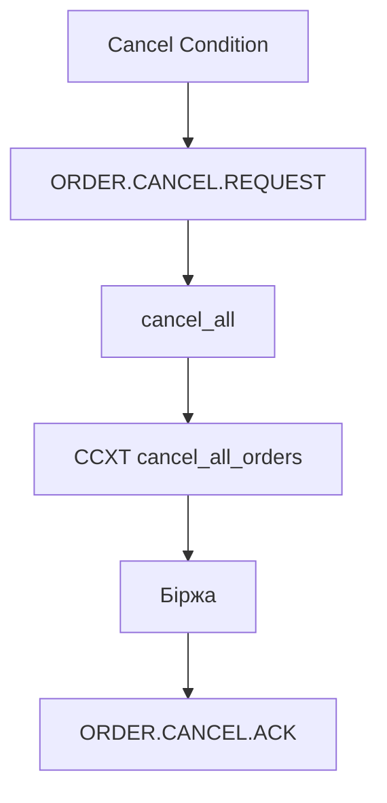

# Cancel Execution Diagram

```mermaid
graph TD
    A[Cancel Condition] --> B[ORDER.CANCEL.REQUEST]
    B --> C[cancel_all]
    C --> D[CCXT cancel_all_orders]
    D --> E[Біржа]
    E --> F[ORDER.CANCEL.ACK]
```