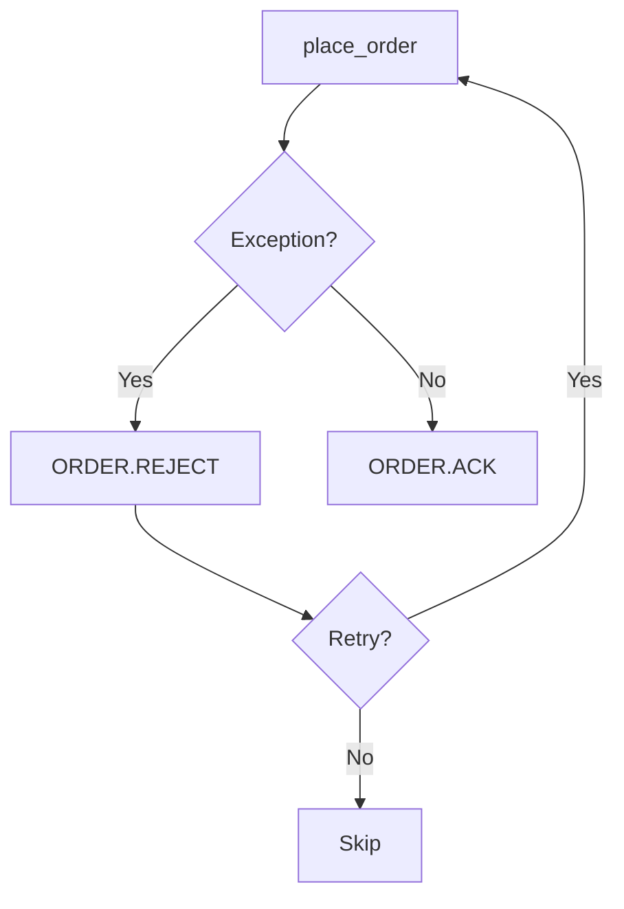

# Reject/Retry Execution Diagram

```mermaid
graph TD
    A[place_order] --> B{Exception?}
    B -->|Yes| C[ORDER.REJECT]
    C --> D{Retry?}
    D -->|Yes| A
    D -->|No| E[Skip]
    B -->|No| F[ORDER.ACK]
```